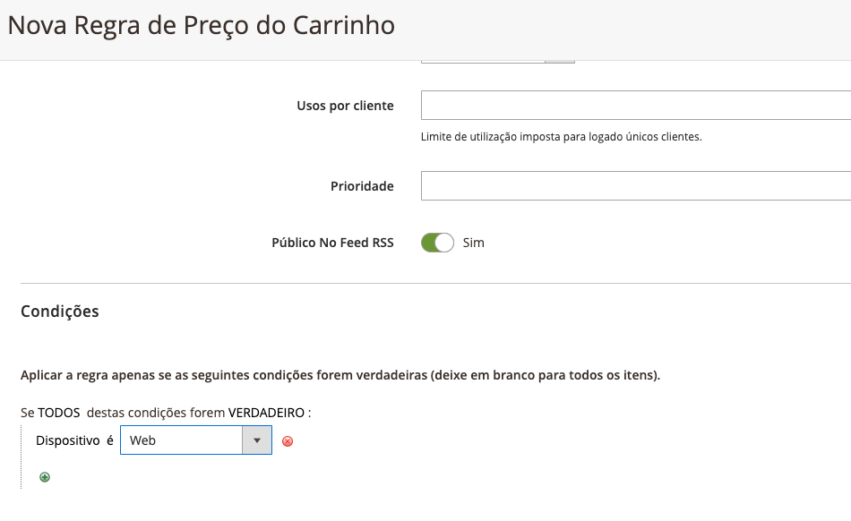

# Criar condição de regra de carrinho

## Descrição macro

O lojista realizou uma pesquisa recentemente onde o acesso a loja acontece menos em dispositivos Android e Web do que IOS. Diante disso, ele precisa criar descontos diferenciados dependendo do dispositivo que o usuários está utilizando.

## Descrição funcional;

* Identificar o dispositivo do usuário via header na API REST do carrinho;
* Aplicar a regra de desconto para o dispositivo identificado;
---------------------------------------
**Dado** um novo pedido criado via API Rest.

**Quando** um dispositivo for identificado no HEADER da chamada.

**Então** aplique a regra de desconto de acordo com o dispositivo.

## Descrição técnica

- Deverá adicionar uma nova condição dentro das regras de promoções de carrinho chamada: Dispositivo
- Customizar a API REST para identificar o tipo de dispositivo;
- A regra deverá ser aplicada caso o dispositivo selecionado esteja definido nas configurações;

## Critérios de aceite

- Deve ser possível criar uma regra de promoção para um dispositivo específico (Web, Android ou iOS)
- Aplicar o desconto ao efetuar uma compra via API Rest com um dispositivo configurado;
- Não aplicar o desconto ao efetuar uma compra via API Rest com um dispositivo não configurado;
- Com o módulo desativado, a condição não deverá estar disponível;

## Informações extra

- [Referência oficial da API Rest](https://developer.adobe.com/commerce/webapi/rest/)
